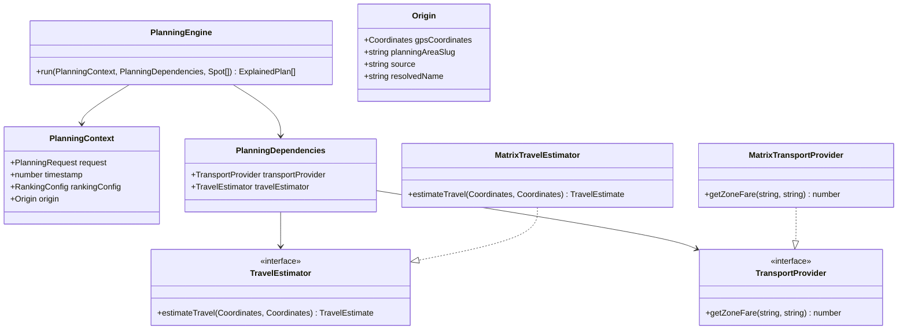
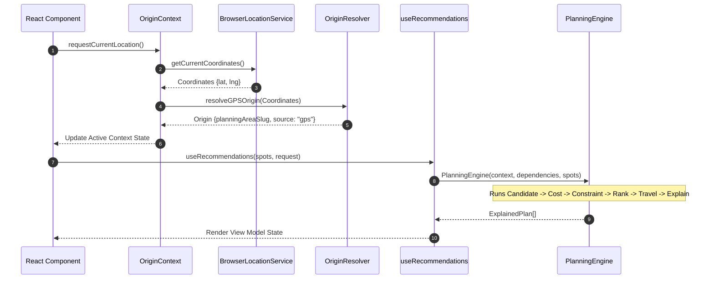

# Planning Engine Technical Bible: Pipeline Architecture & Algorithmic Specifications

This document defines the technical architecture, mathematical specifications, and execution flows of the OyaPlan Planning Engine. It serves as the primary system design reference for engineering teams working on or integrating with the recommendation pipeline.

---

## 1. Core Architecture Overview

The OyaPlan Planning Engine is a stateless, deterministic pipeline. It processes a collection of physical venues (called `Spot` objects) against a `PlanningContext` containing the user’s intent payload.

```
       [Raw Venue Data]
              │
              ▼
   ┌──────────────────────┐
   │  Candidate Engine    │ ───► 1. Filters active & category matches
   └──────────────────────┘
              │
              ▼
   ┌──────────────────────┐
   │     Cost Engine      │ ───► 2. Calculates total cost (Activity + Transport)
   └──────────────────────┘
              │
              ▼
   ┌──────────────────────┐
   │  Constraint Engine   │ ───► 3. Prunes over-budget candidates
   └──────────────────────┘
              │
              ▼
   ┌──────────────────────┐
   │    Ranking Engine    │ ───► 4. Scores by vibe, tier, trust, and metadata
   └──────────────────────┘
              │
              ▼
   ┌──────────────────────┐
   │    Travel Engine     │ ───► 5. Enriches travel estimates (Does not reorder)
   └──────────────────────┘
              │
              ▼
   ┌──────────────────────┐
   │Explainability Engine │ ───► 6. Generates semantic reasons & fit tags
   └──────────────────────┘
              │
              ▼
    [Optimized Output Plan]
```

---

## 2. Pipeline Execution Stages

### Stage 1: Candidate Generation (`CandidateEngine`)
Filter the universe of spots into matching candidates.
- **Rules**:
  - Check if `spot.active === true`.
  - If a specific `categoryGroup` is requested, filter candidates to match.
  - If a `pinnedSpotId` is specified, preserve that spot regardless of other filters.

### Stage 2: Cost Estimation (`CostEngine`)
Calculate the absolute projected cost of the outing.
- **Equation**:
  $$\text{Total Cost} = (\text{Activity Cost} \times \text{Squad Size}) + \text{Transport Cost}$$
- **Activity Cost Calculation**:
  - The engine uses `spot.price_per_person`.
  - Incorporates regional tax policies (e.g., standard 7.5% VAT and 10% service charge where applicable).
- **Transport Cost Calculation**:
  - Resolved via `TransportProvider` using zone-to-zone matrix lookups.
  - Matches the `startArea` slug against the candidate venue's snapped area slug.

### Stage 3: Constraint Checking (`ConstraintEngine`)
Enforce hard mathematical bounds on the candidate set.
- **Rules**:
  - Let $B$ be the user's budget ceiling.
  - Filter out any candidate where $\text{Total Cost} > B$.
  - Exception: A user's pinned spot is never filtered out by budget; instead, we compute its cost and mark it as a budget override.

### Stage 4: Multi-Objective Ranking (`RankingEngine`)
Score and order the surviving candidates. The score is computed using a multi-attribute utility model.
- **Formula**:
  $$S = w_v S_v + w_b S_b + w_c S_c + w_t S_t + w_f S_f + w_p S_p$$
- **Weights**:
  - $w_v$ (Vibe Match Weight) = $0.25$
  - $w_b$ (Budget Match Weight) = $0.20$
  - $w_c$ (Data Confidence Weight) = $0.20$
  - $w_t$ (Trending Score Weight) = $0.15$
  - $w_f$ (Featured Bias Weight) = $0.10$
  - $w_p$ (Pinned Bias Weight) = $0.10$

- **Scoring Dimensions**:
  - **Vibe Match Score ($S_v$)**:
    If the requested vibe matches any tag in `spot.vibe_tags` (case-insensitive), $S_v = 100$, otherwise $S_v = 0$.
  - **Budget Match Score ($S_b$)**:
    Evaluates the proximity of the total cost ($C_t$) to the user's budget ($B$).
    - If $C_t \le 0.5 \times B$, $S_b = 50$ (too cheap, low utility).
    - If $0.5 \times B < C_t \le 0.9 \times B$, $S_b = 100$ (optimal budget zone).
    - If $0.9 \times B < C_t \le B$, $S_b = 80$ (close to limit).
  - **Data Confidence Score ($S_c$)**:
    Directly maps to the venue metadata's `computed_confidence_score` (between $0$ and $100$).
  - **Trending Score ($S_t$)**:
    Normalized ranking factor matching `spot.trending_score` (defaults to $50$ if not set).
  - **Featured Bias ($S_f$)**:
    If `spot.is_featured` is true, $S_f = 100$, otherwise $S_f = 0$.

### Stage 5: Travel Enrichment (`TravelEngine`)
Enrich results with travel parameters without altering rank order.
- **Haversine Distance Equation**:
  $$d = 2 R \arcsin\left(\sqrt{\sin^2\left(\frac{\Delta \phi}{2}\right) + \cos(\phi_1) \cos(\phi_2) \sin^2\left(\frac{\Delta \lambda}{2}\right)}\right)$$
  - Where $R$ is Earth's radius ($6,371\text{ km}$), $\phi$ is latitude, and $\lambda$ is longitude in radians.
- **Estimated Travel Duration**:
  - Under peak-hour traffic (7-10 AM, 4-8 PM on weekdays): Average velocity = $12\text{ km/h}$.
  - Under off-peak traffic / weekends: Average velocity = $25\text{ km/h}$.
  - Calculate base duration:
    $$\text{ETA Minutes} = \max\left(5, \left(\frac{d}{\text{velocity}} \times 60\right) + 5\right)$$

### Stage 6: Semantic Explainability (`ExplainabilityEngine`)
Format planning facts into readable semantic parameters.
- **Fit Explanations**: Generates literal tags such as `"Fits ₦12,500 squad budget"` and `"Prices verified this month"`.
- **Adjacent Area Warning**: If no candidates pass within the user's target area, the engine evaluates adjacent zones and tags them as `"Adjacent Zone Suggestion"`.

---

## 3. Class Interactions & Relationships

The relationship of key classes in the location and planning modules:



---

## 4. Execution Sequence Diagram

The sequence diagram below displays how the application maps GPS locations to client-side planning calculations:



---

## 5. Performance Baselines & Memory footprint

Because the planning engine runs client-side in the user's browser, strict bounds are maintained on execution time and memory allocation:

- **Computational Complexity**: $\mathcal{O}(N \log N)$ where $N$ is the number of active spots (due to sorting in the ranking stage).
- **Execution Time Baselines** (measured on standard mobile browsers):
  - $100$ spots: $< 0.5\text{ ms}$.
  - $500$ spots: $< 1.5\text{ ms}$.
  - $1000$ spots: $< 2.0\text{ ms}$.
- **Memory Overhead**: $< 100\text{ KB}$ per planning pass. We minimize memory churn by reusing candidate arrays and allocating new references only for finalized presentation view models.

---

## 6. Extension Points

The architecture is designed to support the following enhancements without breaking core contracts:

1. **Pluggable Travel Estimators**: The `TravelEstimator` interface can be swapped from the local `MatrixTravelEstimator` to a Google Directions API client by providing a custom implementation of `estimateTravel(origin, destination)`.
2. **Multi-Origin Extensions**: To support group outings starting from different points, the `PlanningContext.origin` can be extended to support an array of starting locations. The `CostEngine` would calculate the mean or max transport fare from all points, keeping the rest of the pipeline intact.
