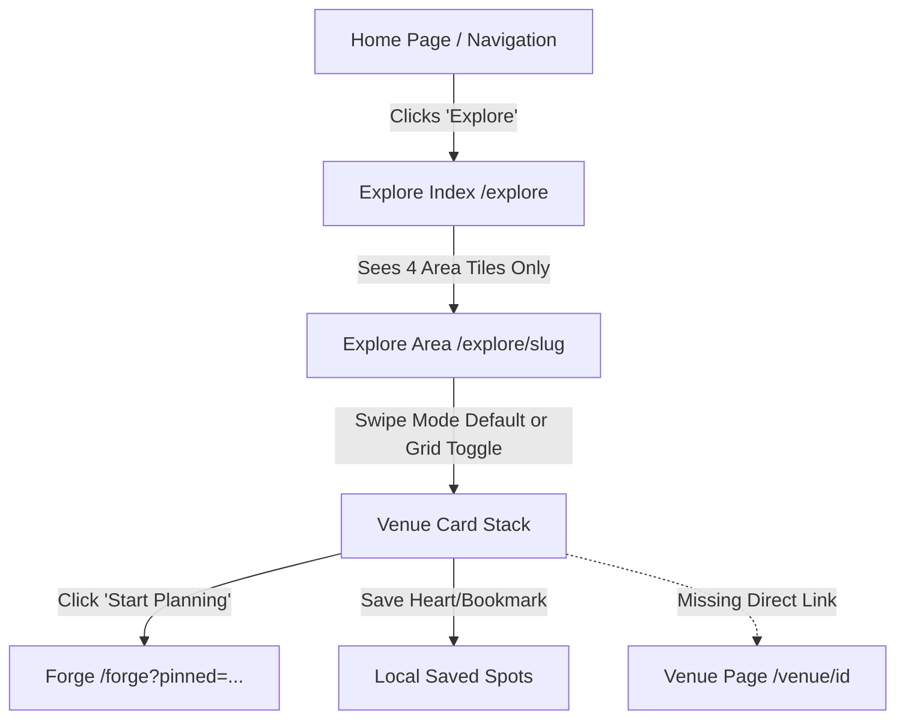

# OyaPlan Phase 8 — Discovery → Search → Decision Audit

**Status:** Completed  
**Role:** Senior Product Designer, UX Architect, Information Architecture Specialist, Consumer Search/Discovery Product Engineer, Trust/Data Product Engineer  
**Date:** September 2026  
**Scope:** `/explore`, `/explore/[slug]`, Search, Filter Surface, Venue Decision Cards, Forge Integration, Saved Spots, Recently Viewed, Mobile-first Discovery Architecture

---

## 1. Executive Summary & Product Problem

Phase 7 fortified the downstream venue decision layer:  
**Plan → Venue → Understand → Decide → Plan This Venue**

Phase 8 addresses the upstream discovery journey for consumers starting with open-ended or partially formed intent:  
> **“I want to go out, but I don't know where.”**

The intended product journey is:  
**Intent → Discover → Shortlist → Understand → Decide → Plan**

### Core Discovery Axiom
> **OyaPlan reduces uncertainty around real-world spending and experiences.**

Explore is **not**:
- A 100-item endless restaurant directory or scroll feed
- An Instagram/TikTok vibe aggregation wall
- A popularity leaderboard or review forum
- An opaque “AI recommendation” scoring engine
- A listicle of generic “top places”

Explore **is**:
- A **decision surface** that deterministically narrows a user's outing intent (Location, Budget, Squad Size, Vibe/Category) into **3–5 high-confidence, fully verifiable options**.

---

## 2. Current Discovery Journey Trace

### Trace Breakdown:
1. **Entry (Home / Navigation):**
   - User navigates to `/explore`. The navbar preserves query parameters between Home and Explore.
2. **Explore Index (`/explore`):**
   - Renders a hero with static text and a 4-card grid for beta areas (`lekki-phase-1`, `vi`, `yaba`, `ikeja`).
   - Does **not** offer instant search, budget filters, or squad inputs on `/explore`.
   - Forces the user to pick an area before they can enter a budget, search for a venue, or specify squad size.
3. **Explore Slug (`/explore/[slug]`):**
   - Loads spots for that specific area (`getAreaWithSpots(slug)`).
   - Defaults to a Tinder-style swipe stack (`VenueCardStack`) with drag mechanics.
   - Has filter controls (Squad +/- stepper, start area select, vibe pills, quick budget buttons).
   - Card button points directly to `/forge?pinned=...` rather than linking seamlessly to the rich `/venue/[id]` decision surface created in Phase 7.
   - Search across all venues is non-existent.

---

## 3. Existing Discovery & UX Problems Audit

| Problem Area | Observed Behavior | Root Cause | Severity |
| :--- | :--- | :--- | :--- |
| **No Unified Global Discovery** | `/explore` only shows 4 static area tiles. A user cannot search or filter across Lagos without picking an area first. | `/explore` was built as an area index rather than a unified intent & discovery surface. | **High** |
| **Missing Search Surface** | No search input on `/explore` or `/explore/[slug]` for venue name, category, or cuisine. | Search component was missing in canonical explore routes. | **High** |
| **Disconnected Decision Loop** | Venue cards on Explore had a CTA to `/forge`, but no clean primary route to `/venue/[id]`. | Phase 7 venue page was built after initial Explore MVP and was never deeply connected into discovery. | **High** |
| **Tinder-Style Swiping Friction** | Swiping cards one-by-one is tedious for users with specific budget or category requirements. | Stack view prioritizes gamification over transparent comparison and scannable decision-making. | **Medium** |
| **Implicit Transport Assumptions** | Discovery cards in `/explore/[slug]` defaulted transport cost based on arbitrary origin assumptions if not selected. | Transport was calculated with hardcoded fallbacks instead of clearly stating whether transport is included or location-dependent. | **Medium** |
| **Incomplete Category / Vibe Filter** | Vibe filters only supported 5 hardcoded items; no category filtering (restaurant, cafe, bar, activity, beach, nature). | Category taxonomy in `lib/types.ts` was not mapped to high-value discovery filters. | **Medium** |
| **No 'Relax One Thing' State** | When filters return 0 spots, UI displays a static "No matches found" with no actionable manual constraint relaxation. | Lack of progressive fallback guidance when constraints are too narrow. | **Medium** |
| **Mobile Header Clutter** | Filter inputs and controls on mobile occupied excessive vertical viewport before cards appeared. | Form controls were stacked vertically in-page rather than using a clean responsive filter sheet. | **Medium** |

---

## 4. Canonical Data Availability & Filter Safety

| Filter / Input | Canonical Source | Completeness | Trust Level | Safe For Filtering? | Missing Data Fallback Behavior |
| :--- | :--- | :--- | :--- | :--- | :--- |
| **Area** | `areas.slug` & `PLANNING_AREAS` (`lib/location/data/lagos_locations.ts`) | 100% for Beta areas (`ikeja`, `yaba`, `vi`, `lekki-phase-1`) | High | **Yes** | Show all active areas; suggest nearby verified hubs if query is empty. |
| **Total Outing Budget / Per-Person** | `spots.price_per_person` & `derived_typical_cost` | 100% across active spots | High / Verified | **Yes** | Use price_per_person * squad size. If missing, flag as "Estimated price". Never filter out without explicit bounds. |
| **Squad Size** | User input (1 to 20 people) | 100% client parameter | High | **Yes** | Default to 2 (or 1 for solo). Calculate total spend as `(price_per_person * squad) + taxes + transport`. |
| **Category** | `spots.category` (`restaurant`, `bar`, `cafe`, `activity`, `nature`, `entertainment`, `beach`, `experience`) | 100% | High | **Yes** | Match exact category. If unset, include all active categories. |
| **Vibe / Occasion** | `spots.vibe_tags` & `EXPERIENCES` | 95%+ across active spots | Medium-High | **Yes** | Case-insensitive tag matching via `VIBE_EXPERIENCE_MAP`. |
| **Search Query** | `spots.name`, `spots.address`, `spots.category`, `spots.vibe_tags`, `areas.name` | 100% | High | **Yes** | Deterministic substring and token matching. No hallucinations. |
| **Data Freshness / Trust** | `spots.price_updated_at`, `spots.computed_confidence_score` | 100% | High | **Yes** | Map to "Verified this week/month", "Community Verified", or "Estimated". |

---

## 5. Ranking & Sorting Analysis

### Existing Behavior:
- `/explore`: Ordered alphabetically by area name (`areas.name`).
- `/explore/[slug]`: Spots fetched by `getAreaWithSpots` were ordered by default database row order or pinned spot index. Server-side filter applied `vibe` and `budget` with binary inclusion/exclusion.
- No explicit user-controlled sorting existed (e.g., spend low-to-high, spend high-to-low, most recently verified).

### Phase 8 Transparent Deterministic Ranking:
1. **Explicit Filters First:** All returned spots strictly satisfy the active Area, Category, and Budget filters.
2. **Deterministic Sort Modes:**
   - **Best Fit (Default):** Exact category/vibe match → Budget proximity (safely within budget without exceeding) → Data freshness (`price_updated_at` descending).
   - **Estimated Spend (Low to High):** `(price_per_person * squad) ASC`.
   - **Estimated Spend (High to Low):** `(price_per_person * squad) DESC`.
   - **Recently Verified:** `price_updated_at DESC`.
3. **No Opaque Scoring:** No synthetic "AI Score" or black-box weights. Every result's position is explainable by transparent criteria.

---

## 6. Architecture & Route Plan

1. **Unified Discovery Surface at `/explore`:**
   - Unified instant search across all venues in Lagos.
   - Quick Area switcher (`All Lagos`, `Lekki Phase 1`, `Victoria Island`, `Yaba`, `Ikeja`).
   - Category & Vibe pills (`All`, `Restaurants`, `Bars & Lounges`, `Cafes`, `Activities & Games`, `Beach & Nature`).
   - Budget & Squad selector with dynamic spend calculation.
   - Fast toggle for Filter Bottom Sheet on mobile / Popover on desktop.
2. **Direct Venue Transition (`/venue/[id]`):**
   - Result card links directly to the canonical Phase 7 venue page.
   - Direct secondary action to start planning (`/forge?pinned=...`).
   - One-tap Save toggle via `useSavedSpots`.
3. **Recently Viewed Shelf Integration:**
   - Factual recently viewed carousel (`useRecentlyViewed`) displayed cleanly without algorithmic preference inference.
4. **Resilient Empty State & "Relax One Thing":**
   - Clear communication of why 0 results matched.
   - Quick one-tap actions to expand area, increase budget, or clear vibe filter.
