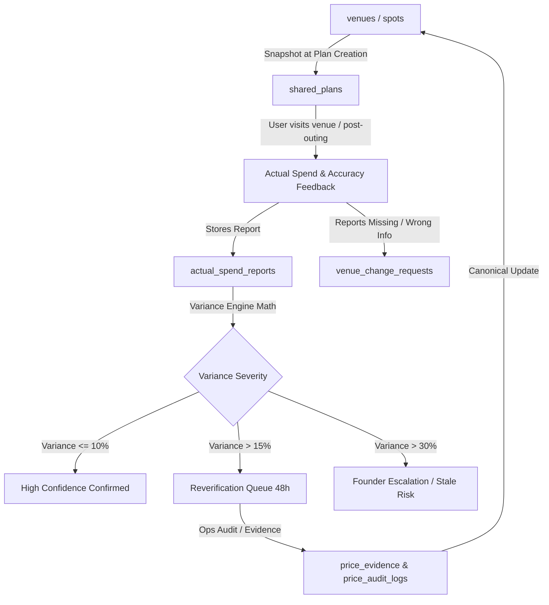

# OyaPlan Phase 9 — Trust & Actual Spend Feedback Loop Audit

**Status:** Completed  
**Role:** Senior Product Engineer, Data/Trust Systems Engineer, Backend Architect, Consumer UX Architect, Analytics/Telemetry Engineer  
**Date:** September 2026  
**Scope:** Trust Infrastructure, Plan Snapshot Integrity, Actual Spend Reporting, Variance Classification, Operational Reverification Triggers, Quality Queues, Consumer Trust Language

---

## 1. Product Thesis & Objectives

OyaPlan’s core differentiator is not catalog size; it is **verified pricing reliability and budget confidence**.

```text
TRUSTED VENUE DATA
        ↓
ESTIMATE
        ↓
USER DECISION
        ↓
PLAN SNAPSHOT
        ↓
ACTUAL OUTING
        ↓
ACTUAL SPEND / FEEDBACK
        ↓
VARIANCE CLASSIFICATION
        ↓
EVIDENCE / REVERIFICATION QUEUE
        ↓
CANONICAL DATA RECALIBRATION
        ↓
BETTER ESTIMATE FOR NEXT USER
```

### Core Axiom: Object Separation
> **Plan ≠ Visit Attribution ≠ Reservation ≠ Actual Spend ≠ Evidence**

- **Plan (`shared_plans`):** What OyaPlan proposed to the user before leaving home.
- **Visit Attribution (`venue_attributed_visits`):** Evidence that a user intended to visit or arrived with an OyaPlan code.
- **Actual Spend (`actual_spend_reports`):** What the user or squad actually paid.
- **Evidence (`price_evidence`):** Verifiable receipt, till audit, menu photo, or ops verification.
- **Verification:** An operational determination that venue information has been audited and approved.

---

## 2. Current Trust Architecture Audit



---

## 3. Data Sources & Provenance Trace

| Data Field / Fact | Canonical Origin | Historical Plan Snapshot | Consumer Representation | Trust Level |
| :--- | :--- | :--- | :--- | :--- |
| **Menu Item Price** | `menu_items.price` & `spots.price_per_person` | Frozen in `shared_plans.food_cost` | Verified menu price or typical spend | High (if verified) / Medium (if estimated) |
| **Transport Fare** | `transport_matrices` & `TransportPricingProvider` | Frozen in `shared_plans.transport_cost` & `transport_estimate` | Estimated transport range | High (if calibrated) / Medium (time-variable) |
| **Taxes & VAT** | `venues.vat_pct` (7.5%) + `service_charge_pct` | Frozen in `shared_plans.explanation` | Known mandatory charges included | High (statutory) |
| **Table / Bottle Policy** | `venues.table_policies` (V1 contract) | Captured in decision card context | Owner submitted / Verified policy | High / Medium |
| **Actual Spend** | `actual_spend_reports.actual_total` | Compared against `shared_plans.total_cost` | Actual Outing Spend | User Report (Observation Layer) |
| **Corrections** | `venue_change_requests` | Associated with `venue_id` | Operational feedback | Pending Review |

---

## 4. Current Gaps & Trust Risks Identified

| Gap / Risk | Impact | Root Cause | Phase 9 Solution |
| :--- | :--- | :--- | :--- |
| **Conflating Variance with Venue Error** | Transport surge or squad size growth could be misattributed as a venue menu price failure. | Simple `actual_total - estimated_total` without distinguishing transport or squad changes. | Structured variance engine separating **venue variance**, **transport variance**, and **squad size changes**. |
| **Handling "Didn't Go" as ₦0 Spend** | If a user didn't go, recording ₦0 spend would distort accuracy statistics. | No dedicated handling for unvisited outings. | Separate outing status ("Did you go? Yes / Not yet / Didn't go") without creating a ₦0 spend row. |
| **Over-Promising Certainty Language** | Language like "No billing shocks here" or "Guaranteed price" implies zero variance. | Marketing copy ahead of evidence threshold. | Audit all trust copy to use truthful framing: "Verified menu pricing", "Estimated total", "Known mandatory charges". |
| **Lack of Minimum Sample Discipline** | Showing precision statistics on 1 or 2 reports. | Aggregate stats rendered without minimum sample gate. | Enforce minimum threshold: at least 1 manual verification + 3 user reports before high confidence display; else "Not enough activity yet". |
| **Stale Venue Inaction** | Venues older than 30 or 60 days remaining in suggestions. | Stale flags were computed in admin but not actively queued. | Formalize >30d queue and >60d suggestion deprioritization. |

---

## 5. Telemetry & Analytics Alignment

Reusing existing analytics pipeline:
- `actual_spend_prompt_viewed`: Feedback sheet displayed.
- `actual_spend_report_started`: User starts entering spend.
- `actual_spend_report_submitted`: Report stored in `actual_spend_reports`.
- `venue_accuracy_feedback_submitted`: Accuracy rating (Yes / Mostly / No / Not sure).
- `venue_correction_submitted`: Structured issue logged in `venue_change_requests`.
- `variance_flagged`: Triggered when variance exceeds 15% or 30%.
- `reverification_created`: Added to ops reverification queue.
