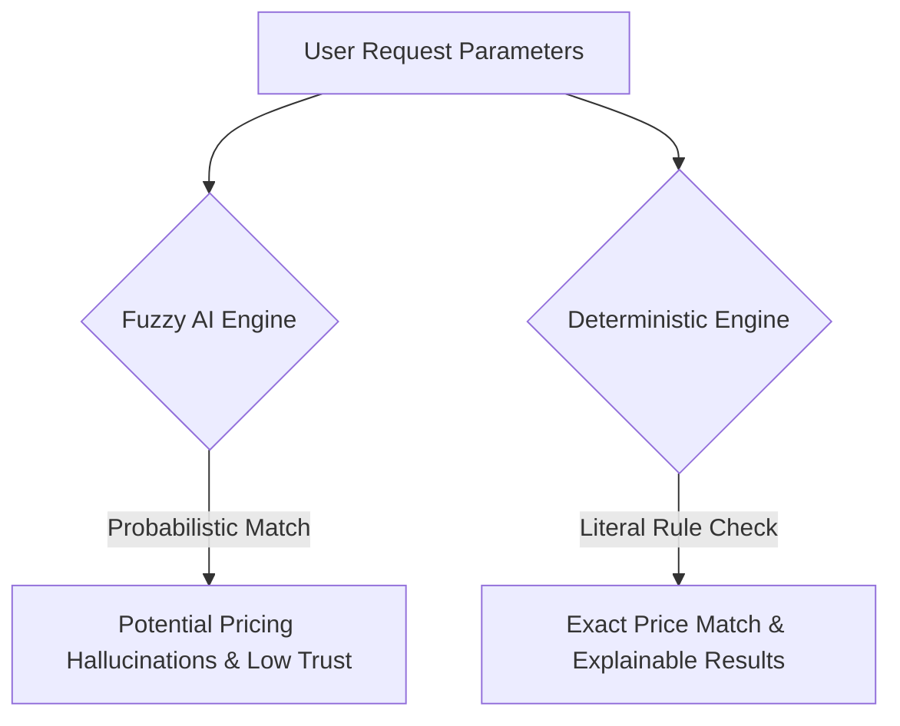

# How OyaPlan Makes Decisions: Founder-Level Product & Technical Philosophy

This document serves as the canonical reference for OyaPlan’s product decision-making, architectural principles, and algorithmic guidelines. It captures the foundational reasoning behind the system for engineering, product, operations, and executive leadership.

---

## 1. Why OyaPlan Exists

The primary friction in group outings is not finding options—it is aligning constraints. Most recommendation systems solve for **preferences** (what people *might* like). OyaPlan solves for **alignment** (what people *can* do, budget, and travel to).

Our core product promise is **Budget Confidence**.
- **The Core User Goal**: Know what I will spend before I leave home.
- **The Anti-Goal**: To be a marketing funnel, a discount aggregator, or a social network.

Every algorithmic layer must serve the goals of predictability, accuracy, and trust.

---

## 2. The Core Principle: Determinism vs. Probability (Why No AI)

OyaPlan uses a deterministic, rule-based matching and ranking engine rather than stochastic or probabilistic machine learning models (such as LLMs, neural collaborative filtering, or fuzzy matching).

### Why Stochastic AI is Banned in the Planning Core

1. **No Hallucinated Outings**: When a squad plans an outing with a strict ₦20,000 budget per person, the system cannot afford to suggest a venue that has outdated pricing or a simulated menu. If the database states a burger is ₦8,500, that must be exactly what is computed. AI-generated responses are probabilistic and cannot guarantee literal adherence to mathematical bounds.
2. **Explainability by Default**: A user must never wonder, *"Why did OyaPlan recommend this?"* In a deterministic model, we can trace every decision back to physical properties: candidate filters, cost equations, and proximity math. This allows us to render transparent labels like `"Fits ₦15,000 squad budget"` and `"Very high data confidence"`.
3. **Execution Latency and Predictability**: Client-side execution of our planning engine takes `< 3ms` for 1,000 venues. A network request to an LLM or vector database introduces hundreds of milliseconds of latency, requires network stability, and incurs variable inference costs.

---

## 3. Data Integrity Boundaries: What We Value vs. What We Ignore

Trust is the single most valuable asset in the OyaPlan ecosystem. To protect user privacy and avoid creepiness, we enforce a strict boundary on the data our engine consumes.

### Data We Actively Consume
- **Intent Inputs**: Squad size, budget ceilings, active geographic starting point (manual area or snapped GPS coordinates), and target vibes.
- **Physical Venue Data**: Verified menus, geographic coordinate points, updated pricing logs, and tax structures (VAT and service charges).

### Data We Intentionally Ignore (Integrity Boundaries)
- **No Browsing History Profiling**: We do not profile users based on previous search paths or venue hover times. Recommendations are built solely on the active intent payload of the current plan.
- **No Social Graph Exploitation**: We do not scrape contacts, mapping friend graphs, or analyzing who plans with whom. A plan is a collaborative sheet, not a data-mining surface.
- **No Dynamic Pricing Scarcity**: We never simulate demand. If a user returns to a plan 10 times, the cost and ranking remain identical unless the physical venue data has been audited and updated in the database.

---

## 4. Key Architectural Trade-offs

Building a production-grade application requires balancing competing engineering and product constraints. OyaPlan operates on three explicit trade-off principles:

| Option A | Option B | OyaPlan Decision & Rationale |
| :--- | :--- | :--- |
| **In-Memory Client Sorting** | **Database-Driven Querying** | **Client-side sorting (Option A)**. Loading active venue candidates once and running the `PlanningEngine` in client memory allows instant UI updates (e.g., as the budget slider moves) without round-trips to the DB. |
| **Simple Proximity Snapping** | **Real-Time API Navigation** | **Distance matrix snapping (Option A)**. Running GPS lookups against browser geolocation API, then snapping coordinates to canonical areas locally. This keeps the application fast and avoids reliance on expensive, slow external Maps APIs during matching. |
| **Conservative Constraints** | **Permissive Over-Recommending** | **Conservative constraint filtering (Option A)**. It is better to show only 2 highly vetted spots that fit the budget than to show 10 spots where 8 are soft approximations. The user's budget ceiling is a hard, unyielding constraint. |

---

## 5. Decision Rules of the Recommendation Engine

When a plan is evaluated, the decision engine runs through these unyielding rules:

1. **The Budget Ceiling Rule**: Any candidate whose total cost (activity price + zone transport fare) exceeds the user's budget ceiling is instantly pruned. No exceptions.
2. **The Verification Rule**: Venues with higher metadata confidence scores (receipts audited within the last 30 days) are ranked higher than historical estimations, protecting users from pricing surprises.
3. **The Travel Enrichment Rule**: Travel times and costs enrich plans; they do not filter or reorder them. Distance calculation is treated as an informative attribute, ensuring the core recommendations remain stable.

---

## 6. How the System Can Evolve Safely

As OyaPlan scales from a single Lagos MVP to a multi-city platform, these decisions must remain intact:
- If we introduce personal recommendations, they must be implemented as client-side toggle configurations, preserving the anonymous-first model.
- If we swap travel estimators (e.g., from linear routing to Google Directions), the interface must remain pure. The calculation remains isolated from the matching core.
