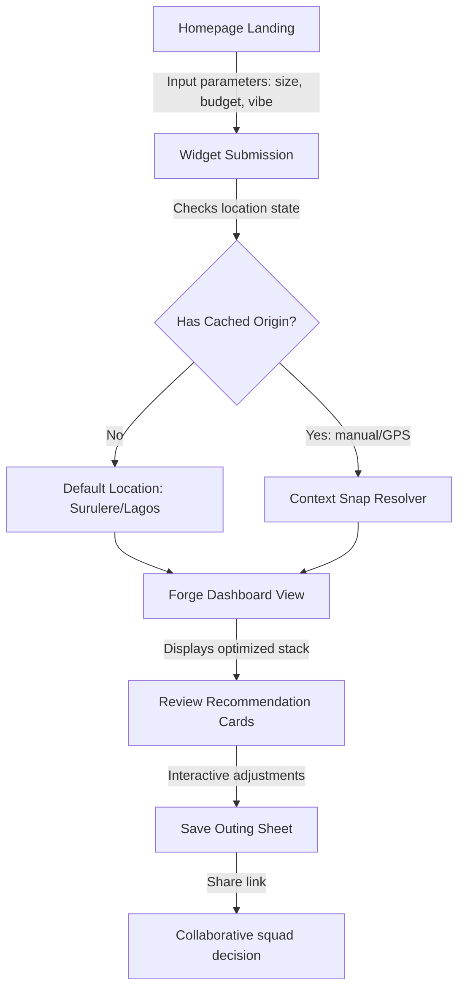

# The OyaPlan Product Bible: Core Principles, Journeys, and Product Terminology

This document serves as the single source of truth for OyaPlan’s product vision, user-experience patterns, and operational principles. It defines how we design, build, and evaluate features to ensure consistency as the product grows.

---

## 1. Mission, Vision, and North Star

### The Mission
To deliver **Budget Confidence** through intuitive planning.

### The Vision
To be the default context-aware assistant that answers: *"What can we realistically do together right now, where will we go, and what will it actually cost before we leave home?"*

### The North Star Metric
- **Plan-to-Outing Ratio**: The percentage of generated plans that lead to real-world outings.
- **Why?**: A plan is only valuable if users trust it enough to walk out the door. We do not optimize for screen time or scrolling depth; we optimize for decision speed and confidence.

---

## 2. Product Principles

Every feature in OyaPlan must adhere to these five non-negotiable principles:

1. **Determinism over Probability**: No AI magic in budget calculations. Users must see exact math. We build trust through transparency, not simulations.
2. **Actionable out of the Box**: Every recommendation must include real-world costs—venue pricing + transportation fares. A recommendation without a cost estimate is not a plan; it is just a listing.
3. **Privacy by Default**: We do not profile user browsing history, track contacts, or enforce social logins. Planning should be anonymous and frictionless.
4. **Context-Aware, Not Profiling-Driven**: Outings are determined by active parameters (Who is going? What is the budget? Where are we starting?) rather than historical data mining.
5. **No Scarcity Mechanics**: We never use fake countdown timers, demand alerts, or simulated seat availability. We build long-term trust, not panic clicks.

---

## 3. Product Boundaries: What OyaPlan Is and Is Not

To maintain focus and avoid feature creep, we enforce clear boundaries:

| OyaPlan Is | OyaPlan Is NOT |
| :--- | :--- |
| A **budget-first planning tool** for squads. | A **social media network** with bios, posts, comments, or likes. |
| A **real-time cost calculator** for outings. | A **marketing site** built to convert ad clicks. |
| A **curated database** of verified local venues. | An **unvetted directory** with scraping-based spam listings. |
| An **anonymous, instant utility**. | A **subscription-locked funnel** requiring long onboarding forms. |

---

## 4. Core Product Vocabulary

To align product, engineering, and operations, we use standard definitions for all terms:

- **Spot**: A physical venue (e.g., restaurant, bar, park, beach) verified by our team.
- **Area**: A canonical local planning neighborhood (e.g., Ikeja, Yaba, Lekki Phase 1).
- **Zone**: A broader administrative region grouping multiple areas (e.g., "Mainland", "Island").
- **Squad**: The group participating in the outing (represented by a size from 1 to 8+).
- **Budget**: The total spending limit per person or for the entire squad.
- **Origin**: The resolved geographical starting point of the plan (manual neighborhood or snapped GPS).
- **Travel Estimate**: The semantic calculation of ETA, distance, and transport fares between the origin and the target spot.
- **Confidence Rating**: The mathematical score representing how fresh and verified a spot's pricing is (e.g. verified via receipt upload within 30 days).

---

## 5. Visualizing User Journeys

The diagram below details the friction-free user journey:



---

## 6. Long-Term Roadmap: Phases of Growth

OyaPlan scales systematically by building value layers:

```
┌────────────────────────────────────────────────────────┐
│ Phase A: Hardening, Stabilization, and Documentation   │ ◄── [We are here]
└────────────────────────────────────────────────────────┘
                           │
                           ▼
┌────────────────────────────────────────────────────────┐
│ Phase B: Curated Collections & Discovery Themes        │
└────────────────────────────────────────────────────────┘
                           │
                           ▼
┌────────────────────────────────────────────────────────┐
│ Phase C: Contextual Search (Vibes, Moods, Events)      │
└────────────────────────────────────────────────────────┘
                           │
                           ▼
┌────────────────────────────────────────────────────────┐
│ Phase D: Lightweight History-based Personalization     │
└────────────────────────────────────────────────────────┘
```
- **Phase A**: Complete architecture documentation, test coverage, and code stabilization.
- **Phase B**: Introduce curated collections (e.g., "Brunches Under ₦20k", "Solo Work Cafés").
- **Phase C**: Implement real-time contextual semantic search to replace simple tag matching.
- **Phase D**: Add local-history personalization (saving favorite areas and budgets) without server-side profiling.
